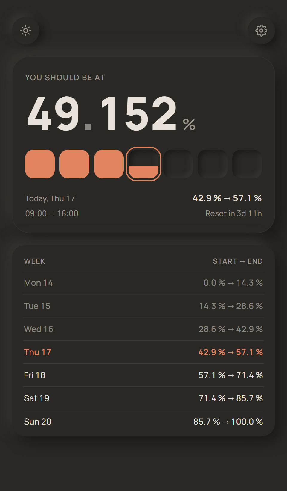

<p align="center">
  
</p>

<h1 align="center">Limits Pace</h1>

<p align="center">
  Where your weekly usage should stand right now, so the budget lasts the week.
</p>

<p align="center">
  <a href="https://avpbynf.github.io/Limits-Pace/"></a>
  
  
</p>

---

<p align="center">
  
</p>
<p align="center">
  <sub>What it opens on: the target right now, the week as seven gauges, and where each day starts and ends.</sub>
</p>

A weekly budget of 100% is easy to burn in two days. Limits Pace shows the one number that
keeps it even: the percentage you should be at, at this very moment, if the week were spent
at a steady pace. Above it or below it, you know at a glance.

The week starts at the weekday and time of your reset. The budget is spread over the working
hours of each day, so the target stays flat overnight and each full working day adds a
seventh. One gauge per day shows how far along its hours you are, and the hours that belong to
the next session are greyed out.

## What it does

- A live target, ticking on a rolling counter, with the time left before the reset.
- Two layouts to choose from, Relief and Dial, each with the week listed under it.
- Your reset day and time, your working hours, the first day of the week and the number of
  decimals and the days off, behind the gear, all kept in the browser.
- Light and dark, following the system until the button at the foot of the screen picks one.
- Installs as an app from the browser menu on a phone, works offline, and reloads itself when
  a new version is published.

## Run locally

Plain static files, any server does:

```bash
python3 -m http.server 8765
```

Then open `http://127.0.0.1:8765`. Installing it as an app needs HTTPS, which the published
page has and this server does not.
